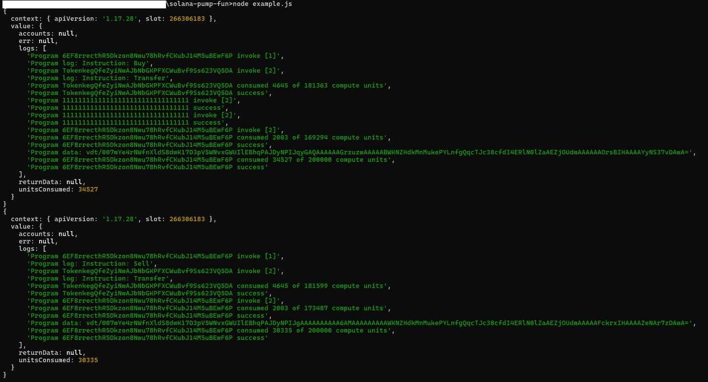

# 提醒

注意：此项目的灵感来自 https://github.com/Allen-Taylor/pump_fun_py，并被修改为使用 TypeScript，同时添加了一些额外功能。此外，还修改了代码以便在一次交易中发送关联的代币账户创建和买卖操作，从而提高速度。

Solana Pump Fun 是一个开源软件包，旨在促进在 Solana 区块链上执行和模拟 pump.fun 的买卖交易。此工具对希望了解 Solana 上交易机制和资源消耗的开发人员和爱好者非常有用。

## 功能

- 模拟在 Solana 区块链上进行 pump.fun 的买卖交易。
- 执行在 Solana 区块链上进行 pump.fun 的买卖交易。
- 提供交易步骤和资源消耗的详细日志。
- 易于使用并集成到现有项目中。

## 前提条件

确保您已安装以下内容：

- [Node.js](https://nodejs.org/) （版本 14 或更高）
- [npm](https://www.npmjs.com/)
- [TypeScript](https://www.typescriptlang.org/)

## 安装

要安装该软件包，请克隆仓库并安装依赖项：

```bash
git clone https://github.com/bilix-software/solana-pump-fun.git
cd solana-pump-fun
npm install
```

## 配置

在运行模拟之前，您需要设置您的私钥并指定代币铸造地址。打开 example.ts 文件，并用您的实际私钥和代币铸造地址替换占位符值。

### 示例配置

在 example.ts 中，设置您的私钥、代币铸造地址和交易模式：

```typescript
const privateKey = 'your_private_key'; // 替换为您的实际私钥
const mintAddress = 'your_token_mint_address'; // 替换为实际代币铸造地址
const txMode = TransactionMode.Simulation; // 设置为 Simulation 以进行测试，Execution 以执行
```

## 使用

要运行示例模拟脚本，请使用 Node.js 执行 example.js 文件或编译并运行 example.ts 文件。这将模拟买卖交易并输出详细日志。

### 运行模拟

1. 确保您的 example.ts 文件配置正确。
2. 编译 TypeScript 文件：

```bash
npx tsc
```

3. 运行编译后的 JavaScript 文件：

```bash
node example.js
```

### 模拟交易

如果您希望在模拟模式下运行交易（不在区块链上进行实际交易），请确保 txMode 设置为 TransactionMode.Simulation。此模式将帮助您了解交易过程而无需承担任何费用。


### 示例输出

以下是运行模拟时生成的输出示例：



## 许可证

This project is licensed under the MIT License - see the [LICENSE](LICENSE) file for details.

### 官方频道：https://t.me/a645645654
### 官方客服：@kexuejia3